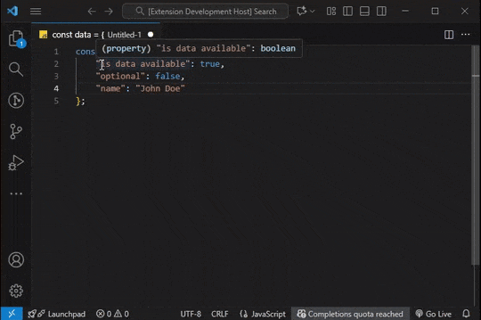
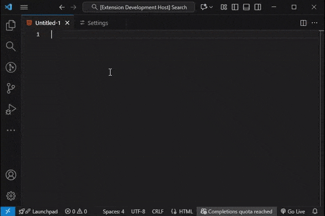
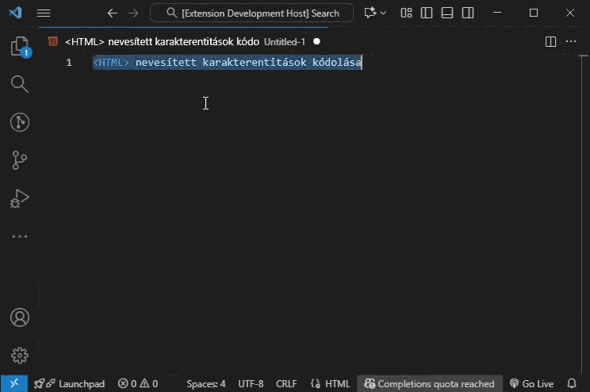

# Playful Sparkle: Dev Toolbox

**Playful Sparkle Dev Toolbox** is your all-in-one solution within Visual Studio Code for URL slug generation, Base64/URL encoding/decoding, GUID generation, and removing empty lines, non-printable characters, and whitespace. This extension streamlines common text manipulation tasks directly in your editor, boosting your productivity without the need for external tools.

Seamlessly integrate these essential features into your coding environment to simplify text processing and generation. Whether you're optimizing URLs, handling data encoding, generating unique IDs, or cleaning up text, **Playful Sparkle Dev Toolbox** provides efficient and reliable tools at your fingertips.

---

## Features

### Text case conversion

### Slugify text (make text URL safe)

")

### GUID generation

### Encoding and conversions

* **Text formatting**
  * Text case conversion commands. Easily convert selected text into various common programming case formats:
    * **Camel case.** Lowercase first word, uppercase subsequent words. Example: `myVariableName`.
    * **Pascal case.** Each word starts with an uppercase letter. Example: `MyClassName`.
    * **Snake case.** Words separated by underscores, all lowercase. Example: `my_variable_name`.
    * **Screaming snake case.** Words separated by underscores, all uppercase. Example: `MY_CONSTANT_NAME`.
    * **Kebab case.** Words separated by hyphens, all lowercase. Example: `my-variable-name`.
    * **Train case.** Words separated by hyphens, all uppercase. Example: `MY-VARIABLE-NAME`.
    * **Flat case.** All words joined without separators, all lowercase. Example: `myvariablename`.
    * **Uppercase.** All characters uppercase without separators. Example: `MYVARIABLENAME`.
  * **Locale aware case conversion.** Provides local aware functions that use locale specific case conversion via `toLocaleLowerCase` and `toLocaleUpperCase`. Includes a fallback to standard `toLowerCase` and `toUpperCase` to ensure consistent behavior across different environments. Allows optional locale parameters to handle language specific case conversion rules.
* **Utilities**
  * **Slugify text (make text URL safe).** Converts text into URL friendly slugs, removes diacritics, special characters, and replaces spaces with hyphens. Attempts to preserve file extensions during slugification, intelligently differentiating between file extensions and other dot separated text.
  * **GUID generation.** Generates Globally Unique Identifiers (GUIDs) with the following formatting options:
    * _Raw format:_ `xxxxxxxx-xxxx-xxxx-xxxx-xxxxxxxxxxxx` (example: `a1b2c3d4-e5f6-7890-9abc-c1d2e3f4a5b6`).
    * _Registry format:_ `{xxxxxxxx-xxxx-xxxx-xxxx-xxxxxxxxxxxx}` (example: `{a1b2c3d4-e5f6-7890-9abc-c1d2e3f4a5b6}`).
    * _Square brackets format:_ `[Guid("xxxxxxxx-xxxx-xxxx-xxxx-xxxxxxxxxxxx")]` (example: `[Guid("a1b2c3d4-e5f6-7890-9abc-c1d2e3f4a5b6")]`).
    * _Less than sign format:_ `<Guid("xxxxxxxx-xxxx-xxxx-xxxx-xxxxxxxxxxxx")>` (example: `<Guid("a1b2c3d4-e5f6-7890-9abc-c1d2e3f4a5b6")>`).
 * **Sort lines (ascending/descending).** Provides advanced Unicode-aware line sorting with the following features:
    * _Locale-aware sorting:_ Supports multiple languages and locales for accurate Unicode character sorting.
    * _Case handling:_ Option to ignore or respect case sensitivity during sorting.
    * _Numeric sorting:_ Natural numeric sorting where "10" comes after "2" (when enabled).
    * _Base letters first:_ Option to sort base letters before accented variants (e.g., 'a' before 'á').
  * **Remove empty lines.** Provides functionality to remove empty lines from text with the following options:
    * When true, removes all empty lines.
    * When false, only removes consecutive empty lines, keeping single empty lines intact.
    * Considers lines with only whitespace (spaces, tabs) as empty when true.
    * Only removes completely empty lines when false.
  * **Remove non printable characters.** Removes characters that are not typically intended for printing or display.
  * **Remove leading and trailing whitespace.** Trims whitespace (spaces, tabs, newlines) from the beginning and end of text.
* **Encoding and conversions**
  * **Base64 encoding/decoding.** Implements `base64Encode` and `base64Decode` functions for seamless Base64 encoding and decoding of text.
  * **URL encoding/decoding.** Provides `urlEncode` and `urlDecode` functions for encoding and decoding text for use in URLs.
  * **Named HTML entities.** Convert characters to named entities and back. Format: `&name;`. Examples: `é` to `&eacute;`, `<` to `&lt;`, `"` to `&quot;`.
  * **HTML hexadecimal character reference**. Use hex numeric entities for any code point. Format: `&#xXXXX;`, `&#xXXXXXX;`. Examples: `é` to `&#x00E9;`, `🔥` to `&#x1F525;`.
  * **HTML decimal character reference.** Use decimal numeric entities for any code point. Format: `&#XXX;`, `&#XXXXXX;`. Examples: `é` to `&#233;`, `🔥` to `&#128293;`.
  * **JavaScript UTF-16 escape sequences.** Encode as UTF 16 units for JS text, supports surrogate pairs. Format: `\XXXX`, `\XXXXXX` (pair shown as two `\XXXX`). Examples: `é` to `\u00E9`, `🔥` to `\uD83D\uDD25`.
  * **CSS Unicode escape sequences.** Encode for CSS text and identifiers, allows optional trailing space. Format: `\XXXX`, `\XXXXXX`. Examples: `é` to `\00E9`, `🔥` to `\1F525`.
  * **Unicode code point notation.** Represent characters as code points for docs and debugging. Format: `U+XXXX`, `U+XXXXX`. Examples: `é` to `U+00E9`, `🔥` to `U+1F525`.
  * **Unicode code point escape sequence.** Encode code points for modern JS. Format: `\u{XX}`, `\u{XXXXX}`. Examples: `é` to `\u{00E9}`, `🔥` to `\u{1F525}`.
  * **PCRE Unicode hexadecimal escapes.** Encode for PCRE compatible regex engines. Format: `\x{XX}`, `\x{XXXXX}`. Examples: `é` to `\x{00E9}`, `🔥` to `\x{1F525}`.
  * **Hex code points.** Show code points with `0x` prefix, useful for debugging. Format: `0xXX`, `0xXXXXX`. Examples: `é` to `0x00E9`, `🔥` to `0x1F525`.
* **Multi-Language Support**: The extension's user interface and informational messages are available in English (en), Magyar (hu), Slovenčina (sk), Čeština (cs), Deutsch (de), Français (fr), Polski (pl), Български (bg), Español (es), Italiano (it), 日本語 (ja), 한국어 (ko), Português do Brasil (pt-br), Русский (ru), Türkçe (tr), 简体中文 (zh-cn), 繁體中文 (zh-tw) languages.

---

## Requirements

This extension has no special requirements or dependencies. It works directly within Visual Studio Code.

---

## Known Issues

* **GUID Generation Predictability:**
    * The `generateGuid` function uses `Math.random()` for GUID generation, which is not cryptographically secure. While suitable for most general-purpose use cases, it should not be used for applications requiring high levels of security or uniqueness.
    * While the GUID generated is very unlikely to be the same, there is still a very small risk of collision.

If you encounter any of these or other issues, please report them on the [GitHub Issues page](https://github.com/playfulsparkle/vscode_ps_dev_toolbox/issues) with detailed steps to reproduce the problem.

---

## Release Notes

### 0.0.18

Added Sort Lines Ascending/Descending which provides advanced, fast, Unicode-aware sorting for entire documents or text selections.

### 0.0.17

Improved decoding across all encoders, added input validation.

### 0.0.16

Translated Command Palette category.

### 0.0.15

* Added support for encoding and decoding percent-encoded URI sequences.

### 0.0.14

* Added "Convert to URL Slug" command to Explorer context menu for renaming files and folders to URL-safe format (supports multi-selection)
* Updated locale handling in text transformation commands

### 0.0.13

* Fixed single block selection for URL slugify
* Added support for multi-line text selection - each line is now slugified separately
* Preserved original line ending delimiters (LF, CRLF, or mixed) when processing multi-line selections

### 0.0.12

* URL slugify supports multi-cursor editing.
* Fixed named HTML entity encoding.
* Fixed hex numeric entity encoding.
* Fixed decimal numeric entity encoding.
* Fixed handling of full Unicode range.
* Fixed ES6 code point escape encoding.
* Fixed extended hex escape generation.
* Fixed CSS escape encode and decode.
* Fixed JS escape encode and decode.
* Fixed script-context escape encode and decode.
* Fixed behavior, then standardized function naming in “encode/decode hex entities.”
* Test cases updated and expanded.

### 0.0.11

Introduced a streamlined issue reporting mechanism in alignment with **Microsoft Visual Studio Code** extension development best practices. This enhancement allows users to report bugs, suggest features, and provide feedback more efficiently, improving overall user experience and support responsiveness.

### 0.0.10

* Updated the logic for removing non-printable characters. Most control characters and specific invisible whitespace are now replaced with a space. Standard whitespace (tab, line feed, carriage return) is preserved, as are zero-width joiners/non-joiners and variation selectors when they are part of character sequences.

### 0.0.9

* Introduced a suite of commands to easily convert selected text to various common programming case formats like `camelCase` (e.g., `myVariableName`), `PascalCase` (e.g., `MyClassName`), `snake_case` (e.g., `my_variable_name`), `SCREAMING_SNAKE_CASE` (e.g., `MY_CONSTANT_NAME`), `kebab-case` (e.g., `my-variable-name`), `TRAIN-CASE` (e.g., `MY-VARIABLE-NAME`), `flatcase` (e.g., `myvariablename`), `UPPERCASE` (e.g., `MYVARIABLENAME`)

### 0.0.8

The updated removal of non-printable characters now neutralizes hidden control characters (e.g., `null bytes`, `zero-width spaces`), maintains complex character sequences (`emojis`, `diacritics`, `joined scripts`) while stripping `broken`/`invalid Unicode artifacts`, eliminates potential injection vectors from malformed surrogate pairs and invisible formatting characters, and guarantees output contains only standardized, renderable characters per Unicode 15.0 specifications.

### 0.0.7

* Updated encode/decode named HTML entity, encode/decode HTML hex entity, encode/decode decimal entity, encode/decode JavaScript unicode escape, encode/decode CSS unicode escape, encode/decode code point, encode ES6 unicode code point escape, encode/decode extended hex escape and encode/decode hex code point now work using multi cursor.

### 0.0.6

* Added support for three new GUID formats.
* Introduced support for the following character encoding and decoding schemes.

### 0.0.5

* The extension's icon color theme has been updated, providing a more polished and consistent look.
* The extension description has been refined to be more clear, concise, and easier for new users to understand its features and benefits.

### 0.0.4

* Remove Empty Lines from Document.
* Remove Empty Lines from Selection.

### 0.0.3

* Re-upload, package was not updated properly.

### 0.0.2

* Removes empty lines from the selected text.
* Removes non-printable characters from the selected text.
* Removes whitespace (spaces, tabs, newlines) from the beginning and end of the selected text.

### 0.0.1
* Locale-Aware Case Conversion.
* URL-Friendly Slug Generation.
* Base64 Encoding/Decoding.
* URL Encoding/Decoding.
* GUID Generation.

---

## Support

For any inquiries, bug reports, or feature requests related to the **Playful Sparkle: Dev Toolbox** extension, please feel free to utilize the following channels:

* **GitHub Issues**: For bug reports, feature suggestions, or technical discussions, please open a new issue on the [GitHub repository](https://github.com/playfulsparkle/vscode_ps_dev_toolbox/issues). This allows for community visibility and tracking of reported issues.
* **Email Support**: For general questions or private inquiries, you can contact the developer directly via email at `support@playfulsparkle.com`. Please allow a reasonable timeframe for a response.

We encourage users to use the GitHub Issues page for bug reports and feature requests as it helps in better organization and tracking of the extension's development.

---

## License

This extension is licensed under the [BSD-3-Clause License](https://github.com/playfulsparkle/vscode_ps_dev_toolbox/blob/main/LICENSE). See the `LICENSE` file for complete details.

---

## Author

Hi! We're the team behind Playful Sparkle, a creative agency from Slovakia. We got started way back in 2004 and have been having fun building digital solutions ever since. Whether it's crafting a brand, designing a website, developing an app, or anything in between, we're all about delivering great results with a smile. We hope you enjoy using our Visual Studio Code extension!