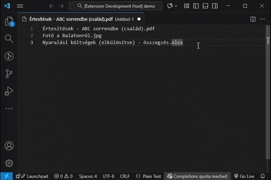
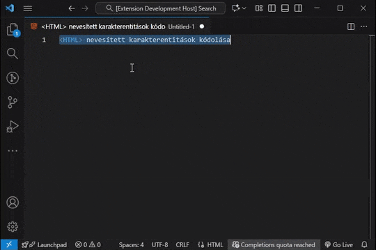

# Playful Sparkle: Dev Toolbox

**Dev Toolbox** is a Visual Studio Code extension that provides essential text manipulation tools including URL slug generation, Base64/URL encoding/decoding, GUID generation, text case conversion, and advanced text cleaning.

Streamline your development workflow with comprehensive text processing tools directly in your editor. From cleaning problematic text to generating identifiers and converting text formats, **Dev Toolbox** handles common development tasks efficiently.

---

## Text Case Conversion

## Slugify Text

## GUID Generation

## Encoding and Conversions

---

## Features

* **Text formatting**
  * Text case conversion commands. Easily convert selected text into various common programming case formats:
    * **Camel case.** Lowercase first word, uppercase subsequent words. Example: `myVariableName`.
    * **Pascal case.** Each word starts with an uppercase letter. Example: `MyClassName`.
    * **Snake case.** Words separated by underscores, all lowercase. Example: `my_variable_name`.
    * **Screaming snake case.** Words separated by underscores, all uppercase. Example: `MY_CONSTANT_NAME`.
    * **Kebab case.** Words separated by hyphens, all lowercase. Example: `my-variable-name`.
    * **Train case.** Words separated by hyphens, all uppercase. Example: `MY-VARIABLE-NAME`.
    * **Flat case.** All words joined without separators, all lowercase. Example: `myvariablename`.
    * **Uppercase.** All characters uppercase without separators. Example: `MYVARIABLENAME`.
  * **Locale aware case conversion.** Provides local aware functions that use locale specific case conversion via `toLocaleLowerCase` and `toLocaleUpperCase`. Includes a fallback to standard `toLowerCase` and `toUpperCase` to ensure consistent behavior across different environments. Allows optional locale parameters to handle language specific case conversion rules.
* **Utilities**
  * **Slugify text (make text URL safe).** Converts text into URL friendly slugs, removes diacritics, special characters, and replaces spaces with hyphens. Attempts to preserve file extensions during slugification, intelligently differentiating between file extensions and other dot separated text.
  * **GUID generation.** Generates Globally Unique Identifiers (GUIDs) with the following formatting options:
    * _Raw format:_ `xxxxxxxx-xxxx-xxxx-xxxx-xxxxxxxxxxxx` (example: `a1b2c3d4-e5f6-7890-9abc-c1d2e3f4a5b6`).
    * _Registry format:_ `{xxxxxxxx-xxxx-xxxx-xxxx-xxxxxxxxxxxx}` (example: `{a1b2c3d4-e5f6-7890-9abc-c1d2e3f4a5b6}`).
    * _Square brackets format:_ `[Guid("xxxxxxxx-xxxx-xxxx-xxxx-xxxxxxxxxxxx")]` (example: `[Guid("a1b2c3d4-e5f6-7890-9abc-c1d2e3f4a5b6")]`).
    * _Less than sign format:_ `<Guid("xxxxxxxx-xxxx-xxxx-xxxx-xxxxxxxxxxxx")>` (example: `<Guid("a1b2c3d4-e5f6-7890-9abc-c1d2e3f4a5b6")>`).
 * **Sort lines (ascending/descending).** Provides advanced Unicode-aware line sorting with the following features:
    * _Locale-aware sorting:_ Supports multiple languages and locales for accurate Unicode character sorting.
    * _Case handling:_ Option to ignore or respect case sensitivity during sorting.
    * _Numeric sorting:_ Natural numeric sorting where "10" comes after "2" (when enabled).
    * _Base letters first:_ Option to sort base letters before accented variants (e.g., 'a' before 'á').
  * **Remove empty lines.** Provides functionality to remove empty lines from text with the following options:
    * When true, removes all empty lines.
    * When false, only removes consecutive empty lines, keeping single empty lines intact.
    * Considers lines with only whitespace (spaces, tabs) as empty when true.
    * Only removes completely empty lines when false.
  * **Remove non printable characters.** Removes characters that are not typically intended for printing or display.
  * **Remove leading and trailing whitespace.** Trims whitespace (spaces, tabs, newlines) from the beginning and end of text.
* **Encoding and conversions**
  * **Base64 encoding/decoding.** Implements `base64Encode` and `base64Decode` functions for seamless Base64 encoding and decoding of text.
  * **URL encoding/decoding.** Provides `urlEncode` and `urlDecode` functions for encoding and decoding text for use in URLs.
  * **Named HTML entities.** Convert characters to named entities and back. Format: `&name;`. Examples: `é` to `&eacute;`, `<` to `&lt;`, `"` to `&quot;`.
  * **HTML hexadecimal character reference**. Use hex numeric entities for any code point. Format: `&#xXXXX;`, `&#xXXXXXX;`. Examples: `é` to `&#x00E9;`, `🔥` to `&#x1F525;`.
  * **HTML decimal character reference.** Use decimal numeric entities for any code point. Format: `&#XXX;`, `&#XXXXXX;`. Examples: `é` to `&#233;`, `🔥` to `&#128293;`.
  * **JavaScript UTF-16 escape sequences.** Encode as UTF 16 units for JS text, supports surrogate pairs. Format: `\XXXX`, `\XXXXXX` (pair shown as two `\XXXX`). Examples: `é` to `\u00E9`, `🔥` to `\uD83D\uDD25`.
  * **CSS Unicode escape sequences.** Encode for CSS text and identifiers, allows optional trailing space. Format: `\XXXX`, `\XXXXXX`. Examples: `é` to `\00E9`, `🔥` to `\1F525`.
  * **Unicode code point notation.** Represent characters as code points for docs and debugging. Format: `U+XXXX`, `U+XXXXX`. Examples: `é` to `U+00E9`, `🔥` to `U+1F525`.
  * **Unicode code point escape sequence.** Encode code points for modern JS. Format: `\u{XX}`, `\u{XXXXX}`. Examples: `é` to `\u{00E9}`, `🔥` to `\u{1F525}`.
  * **PCRE Unicode hexadecimal escapes.** Encode for PCRE compatible regex engines. Format: `\x{XX}`, `\x{XXXXX}`. Examples: `é` to `\x{00E9}`, `🔥` to `\x{1F525}`.
  * **Hex code points.** Show code points with `0x` prefix, useful for debugging. Format: `0xXX`, `0xXXXXX`. Examples: `é` to `0x00E9`, `🔥` to `0x1F525`.
* **Multi-Language Support**: The extension's user interface and informational messages are available in English (en), Magyar (hu), Slovenčina (sk), Čeština (cs), Deutsch (de), Français (fr), Polski (pl), Български (bg), Español (es), Italiano (it), 日本語 (ja), 한국어 (ko), Português do Brasil (pt-br), Русский (ru), Türkçe (tr), 简体中文 (zh-cn), 繁體中文 (zh-tw) languages.

---

## Requirements

This extension has no special requirements or dependencies. It works directly within Visual Studio Code.

---

## Known Issues

- **GUID Generation Predictability**
  The GUID generation uses `Math.random()` which is suitable for general purposes but not cryptographically secure. While collision risk is minimal, avoid for security-critical applications.

- **Large File Processing**
  Text processing operations occur in memory. Very large documents may experience performance impacts. Consider processing selections for optimal performance.

If you encounter any of these or other issues, please report them on the [GitHub Issues page](https://github.com/playfulsparkle/vscode_ps_dev_toolbox/issues) with detailed steps to reproduce the problem.

---

## Release Notes

### 0.0.23

- Fixed bug checking file exists for renaming file/folder.

### 0.0.22

- Fixed bug parsing multi-line slug processing.
- Fixed bug escaping slug separator.
- Refactored slug generator, betted handling of double extension like `.tar.gz`, support for unicode, LTR/RTL, emoji characters.

### 0.0.21

- Refactored clean text, the text is now processed by character‑by‑character loop: first normalises malformed Unicode sequences, then uses lookup sets to strip hidden control characters, preserve valid surrogate pairs, and clean up exotic spaces and dashes.

### 0.0.20

- Fixed command `removeLeadingTrailingWhitespaceDocument` not found.
- Optimized, normalized leading and trailing whitespace command.

### 0.0.19

- Renamed `Remove Non-printable Characters` to `Clean Text (Remove Non-printable Characters & Normalize)` and enhanced the function to normalize spaces, dashes, and preserve complex Unicode characters.

### 0.0.18

- Added Sort Lines Ascending/Descending with advanced, fast, Unicode-aware sorting for documents or selections.

### 0.0.17

- Improved decoding across all encoders with enhanced input validation.

### 0.0.16

- Translated Command Palette category for better internationalization.

### 0.0.15

- Added support for encoding and decoding percent-encoded URI sequences.

### 0.0.14

- Added "Convert to URL Slug" command to Explorer context menu for file and folder renaming
- Updated locale handling in text transformation commands

### 0.0.13

- Fixed single block selection for URL slugify
- Added multi-line text selection support with original line ending preservation

### 0.0.12

- URL slugify supports multi-cursor editing
- Fixed encoding/decoding across all entity types
- Improved full Unicode range handling
- Standardized function naming and expanded test coverage

### 0.0.11

- Introduced streamlined issue reporting aligned with Microsoft Visual Studio Code extension development best practices.

### 0.0.10

- Updated non-printable character removal to replace control characters with spaces while preserving standard whitespace and complex character sequences.

### 0.0.9

- Added comprehensive text case conversion suite including camelCase, PascalCase, snake_case, kebab-case, and other common programming formats.

### 0.0.8

- Enhanced non-printable character removal to neutralize hidden control characters while maintaining complex Unicode sequences and eliminating malformed surrogate pairs.

### 0.0.7

- Improved multi-cursor support for all encoding/decoding operations including HTML entities, Unicode escapes, and code point transformations.

### 0.0.6

- Added support for three new GUID formats
- Introduced comprehensive character encoding and decoding schemes

### 0.0.5

- Updated extension icon theme for polished appearance
- Refined extension description for clarity and user understanding

### 0.0.4

- Added Remove Empty Lines from Document and Selection with configurable whitespace handling.

### 0.0.3

- Re-upload to address package update issues.

### 0.0.2

- Remove empty lines from selected text
- Remove non-printable characters from selections
- Remove leading/trailing whitespace from text

### 0.0.1

- Initial release with locale-aware case conversion, URL slug generation, Base64/URL encoding/decoding, and GUID generation.

---

## Support

For any inquiries, bug reports, or feature requests related to the **Playful Sparkle: Dev Toolbox** extension, please feel free to utilize the following channels:

* **GitHub Issues**: For bug reports, feature suggestions, or technical discussions, please open a new issue on the [GitHub repository](https://github.com/playfulsparkle/vscode_ps_dev_toolbox/issues). This allows for community visibility and tracking of reported issues.

* **Email Support**: For general questions or private inquiries, you can contact the developer directly via email at `support@playfulsparkle.com`. Please allow a reasonable timeframe for a response.

We encourage users to use the GitHub Issues page for bug reports and feature requests as it helps in better organization and tracking of the extension's development.

---

## License

This extension is licensed under the [BSD-3-Clause License](https://github.com/playfulsparkle/vscode_ps_dev_toolbox/blob/main/LICENSE). See the `LICENSE` file for complete details.

---

## Author

Hi! We're the team behind Playful Sparkle, a creative agency from Slovakia. We got started way back in 2004 and have been having fun building digital solutions ever since. Whether it's crafting a brand, designing a website, developing an app, or anything in between, we're all about delivering great results with a smile. We hope you enjoy using our Visual Studio Code extension!